# CURSO GIT

## CLASE 1

### Avance de la clase:

- Instalacion de git https://git-scm.com/downloads de esta pagina
- Creacion de un proyecto con git con el comando `git init nombre-proyecto`
- Crear cuenta de github
- Subir el proyecto a un repositorio remoto creado en tu cuenta de github

### Que es un repositorio:

En GitHub, un repositorio es un almacenamiento virtual para proyectos de código y sus cambios. Es como una carpeta en un proyecto que contiene todos los archivos, documentación y el historial de versiones de cada archivo. Los repositorios permiten a los desarrolladores trabajar juntos, almacenar código y versionarlo, y pueden ser públicos, privados o internos.

### Que es un commit:

En Git, un "commit" (o confirmación) es una instantánea del estado de un proyecto en un momento específico. Es como guardar un punto de control del desarrollo, registrando exactamente cómo eran los archivos y directorios en ese instante.

## CLASE 2

### Ramas:

En Git, una rama (branch) es una bifurcación del código que permite a los desarrolladores trabajar en diferentes versiones de un proyecto sin afectar al código principal.

### Git Switch:

El comando `git switch -c <nombre>` crea una nueva rama y te dirige automaticamente a la nueva rama. Por otra parte el comando `git switch <rama>` cambia de la rama en la que estas a la rama deseada.

## Git Status

El comando `git status ` sirve para mostrar el estado actual del directorio de trabajo y el área de staging en un repositorio Git.

## Estados:

### Modified:

El archivo ha sido creado, modificado o eliminado y no se han confirmado los cambios.

### Staged:

El archivo ha sido marcado como preparado para ser confirmado en el repositorio local.

##### Git Add:

Con el comando `git add <archivo> ` se cambia el estado de modified a staged de los archivos que se deseen.

### Commited:

El archivo ha sido grabado en el directorio local (commit).

#### Git Commit:

Con el comando `git commit -m 'mensaje'` se cambia el estado de staged a commited esto hace una fotografia de todos los cambios confirmados.

#### Commit:

Un commit es como una fotografia del estado de todos los archivos en un determinado punto, va con una firma de autor, fecha, localizacion y otra informacion util.

## Git Log:

El comando `git log` muestra el historial de commits en un repositorio, permitiendo visualizar y filtrar los cambios realizados en el proyecto.

## HEAD:

HEAD es un puntero que indica la última confirmación que has extraído en la rama actual, o en la que estás trabajando.

## CLASE 3

### Fusionando ramas:

Empleamos el comando `git merge <rama solicitada>` para incorporar los cambios de una rama a la rama en la que nos encontramos en ese momento.
Se puede hacer multiples fusiones de ramas.
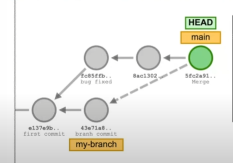
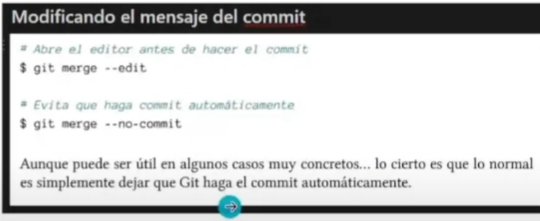

### Eliminar ramas:

Se deben eliminar las ramas para tener un entorno de trabajo limpio y por buena practica.

`git branch -d <rama>`
`git branch -D <rama>` -> de cierta forma como que obliga a eliminar la rama si esta no esta fucionada a ninguna otra rama.

### Conflictos en git:

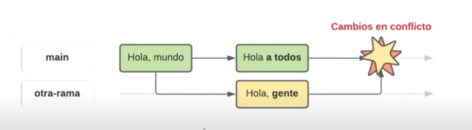
Decidir entre:

- Nos quedamos con los cambios de la rama main.
- Nos quedamos con los cambios de la rama change.
- Modificar los cambios para hacer una fusion personalizada.

## CLASE 4

### Git y GitHub son lo mismo?:

- Git es un control de versiones.
- GitHub es un servicio de alojamiento de codigo fuente basado en el sistema de control de versiones
  (hay muchos igual a github).

  ### Git remote:

  El comando `git remote add origin <enlace>` enlaza tu repositorio remoto con el repositorio local.
  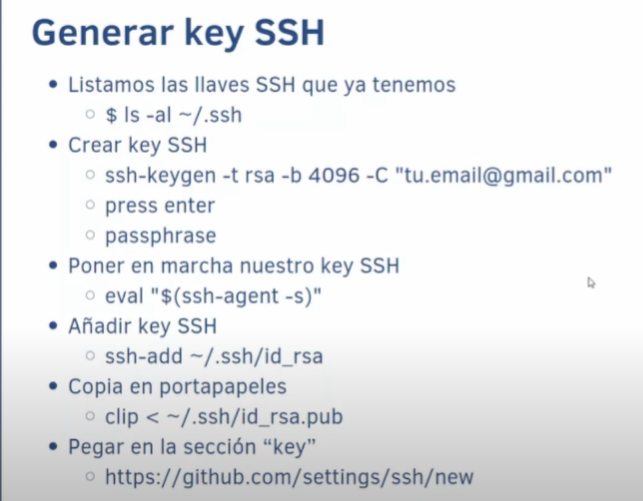
  Las llaves ssh evita que alguien se haga pasar por ti.

  ### Git clone:

  Clona un repositorio remoto en tu repositorio local.
  `git clone <enlace>`

  ### Git push:

  `git push` nos sirve para empujar cualquier cambio o modificacion del repositorio local al repositorio remoto.
  `git push -u`-> Enlaza la rama local con la rama remota.
  `git push -f` ->

  ### Git pull:

  `git pull` sirve para jalar los cambios o descargarlos desde el repositorio remoto al local.

  #### git pull -f:

  Usar git push -f (force push) se considera generalmente una mala práctica por varias razones importantes, principalmente porque reescribe el historial del repositorio remoto, lo que puede causar problemas significativos para otros colaboradores. Piénsalo así: es como reescribir un capítulo de un libro compartido después de que otros ya lo han leído y basado su trabajo en él.

  #### EXPERIMENTOS

  Traernos cambios de otras ramas a la actual: Sí, `git pull` se utiliza para traer cambios de una rama remota a tu rama local actual.
  Traernos los cambios de varias ramas a una sola: No directamente con un solo comando `git pull`. Tendrías que hacer un git checkout a la rama destino y luego hacer git merge de las otras ramas o usar otras estrategias como git cherry-pick.
  Quiero traerme cambios solo con `git pull`: `git pull` es el comando principal para traer cambios remotos a tu rama local.
  ¿Se pueden producir conflictos con `git pull`?: Sí, se pueden producir conflictos si hay cambios en el repositorio remoto que chocan con cambios locales en los mismos archivos. Git te avisará de estos conflictos para que los resuelvas manualmente.

  ### Que es una pull request?:

  Una PR es una peticion de cambios que se envia al repositorio original.

  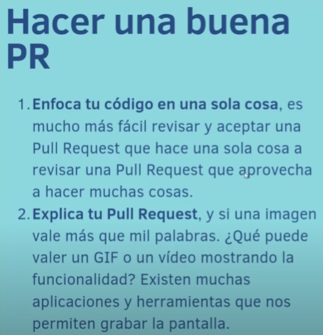
  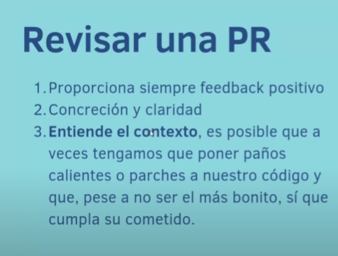

  ## CLASE 5

  ### Que es un GitFlow?:

  Es la menera en la que un equipo de desarrollo va a utilizar git para poder trabajar de manera colaborativa.

  ### Git Flow:

  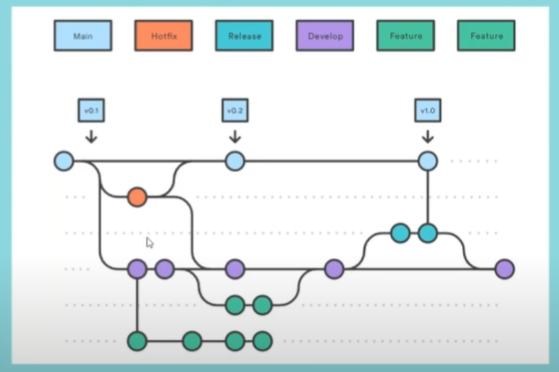

  #### Main:

  Contener el codigo de produccion.

  #### Develop:

  Codigo de pre-produccion que todavia tienen que ser probadas y validadas.

  #### Feature:

  Caracteristicas nuevas para el proyecto.

  #### Release:

  Cambios de ultimo momento

  #### Hotfix:

  Parches para arreglar bugs pequeños

  ### GitHub Flow:

  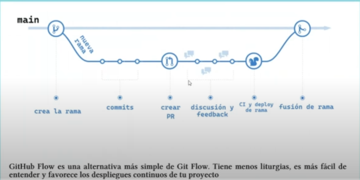
  Rama y cualquier otra rama que quiera ser integrada por medio de una Pull Request

  ### Trunk Based Development:

  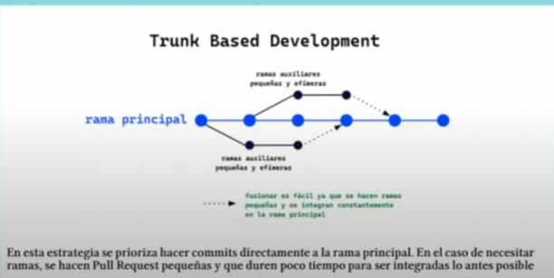

  Solo la rama main y ramas auxiliares efimeras que quiera ser integrada por medio de una Pull Request.

  ### Ship / Show / Ask

  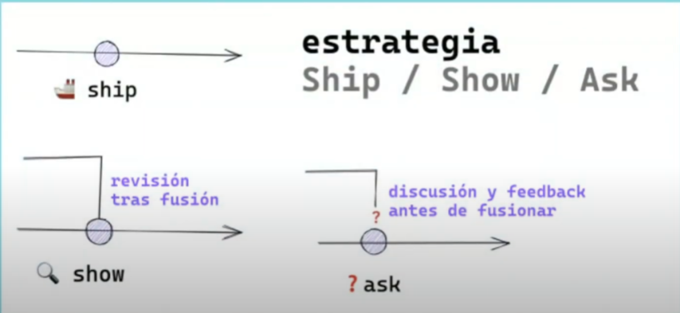

  #### Ship:

  Se fuciona en la rama principal sin revision.

  #### Show:

  Abre una peticion de cambios para que sean revisados por CI pero se fusiona inmediatamente.

  #### Ask:

  Abre una PR para discutir los cambios antes de fusionarlos.

### Las reglas de Ship / Show / Ask

- Tenemos un buen sistema de CI/CD.

- Confiamos en el equipo y existen buenas prácticas de desarrollo. Pair programming, mob programming, seniority… y, sobre todo, existe responsabilidad. La persona se responsabiliza de decidir la categoría de su cambio. Un gran poder, poder hacer merge de tus propias Pull Request, conlleva una gran responsabilidad (no romper producción).

- Las revisiones de código no son requerimientos.

- Las ramas son lo más pequeñas posibles, tienen un tiempo de vida corto y siempre salen directamente desde la rama principal.

- El equipo ha sabido lidiar con el ego individual, las personas confían en el resto del equipo y las pruebas automáticas pasan.

## CLASE 6

### Para que sirven las buenas practicas?:

- Es un estandar manejado en la mayoria de equipos de desarrollo.
- Resolver conflictos o problemas durante el desarrollo es mas facil.
- Tu historial de commits es mas legible.

### Cada cuanto deberia hacer un commit?:

**A menudo.**

### Escribir buenos commits:

- Usar el verbo imperativo (Add, Change, Fix, Remove)

- No uses punto final ni puntos suspensivos en tus mensajes (a lo más usa la coma)

- Usa como máximo 50 caracteres para tu mensaje de commit

- Añade todo el contexto que se necesario en el cuerpo del commit (con reglas de puntuación)

- Considera usar utilidades para hacer commit

- Usa un prefijo para tus commits para hacerlos más semánticos

EJEMPLO: `feat: add new search feature`

### Tipos de prefijos:

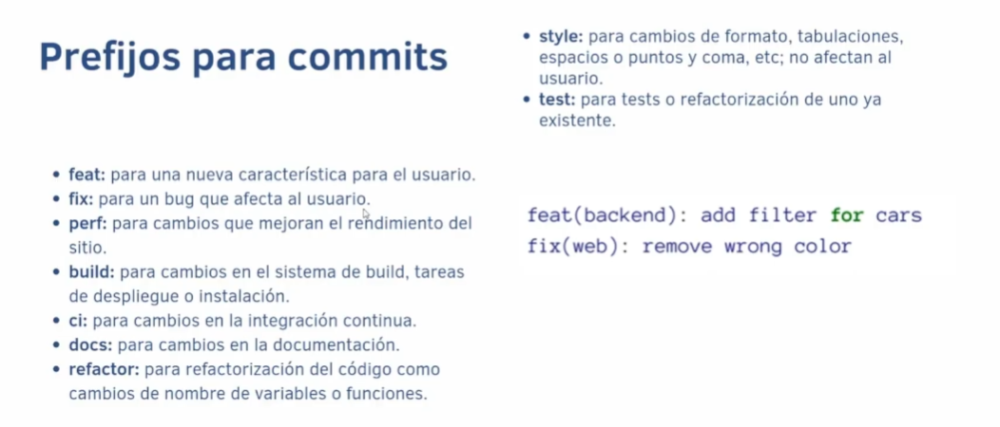

### Escribir buenos nombres de rama:

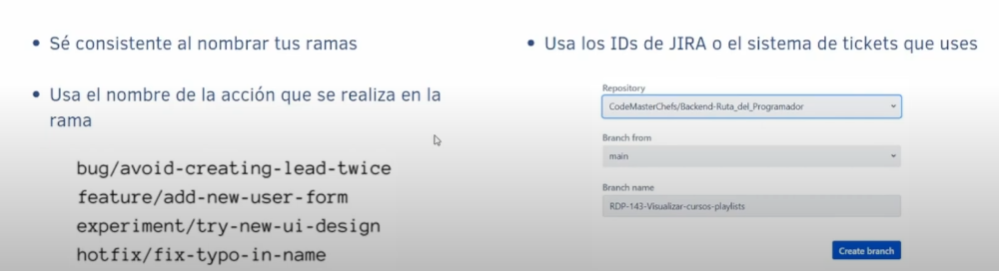

## CLASE 7

### En que casos deshacemos cambios:

- Dejo de funcionar el proyecto.
- Queremos recuperar una parte del codigo que eliminamos.
- Queremos eliminar archivos que eliminamos.

### Comandos destructivos y no destructivos:

Los comandos destructivos afectan el historial de commits realizado, sin embargo los comando no destructivos trabajan en base al historial sin afectarlo.

### Git reset

Posee 2 opciones:

- _soft:_ Mantiene los cambios que ocurrieron antes de hacer commit desde donde apuntaba.
- _hard:_ Descarta los cambios.

### Git revert

Revierte los cambios que un commit introdujo, y crea un nuevo commit con los cambios revertidos.
_NO BORRA COMMITS_
_PUEDE OCURRIR CONFLICTOS_

### Git checkout

Nos permite recuperar codigo especifico de commits.
`git checkout <id_commit>`
