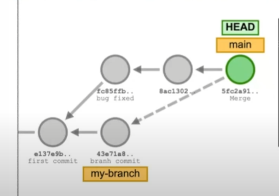
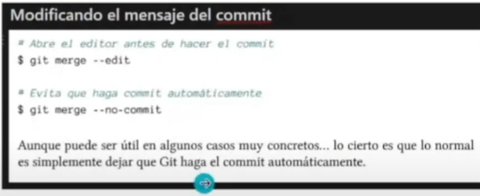
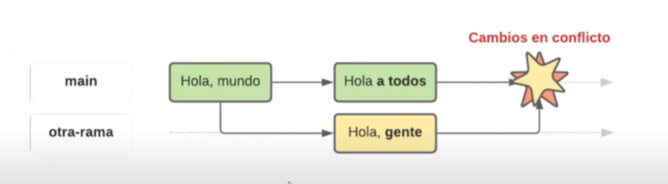

# CURSO GIT

## CLASE 1

### Avance de la clase:

- Instalacion de git https://git-scm.com/downloads de esta pagina
- Creacion de un proyecto con git con el comando `git init nombre-proyecto`
- Crear cuenta de github
- Subir el proyecto a un repositorio remoto creado en tu cuenta de github

### Que es un repositorio:

En GitHub, un repositorio es un almacenamiento virtual para proyectos de código y sus cambios. Es como una carpeta en un proyecto que contiene todos los archivos, documentación y el historial de versiones de cada archivo. Los repositorios permiten a los desarrolladores trabajar juntos, almacenar código y versionarlo, y pueden ser públicos, privados o internos.

### Que es un commit:

En Git, un "commit" (o confirmación) es una instantánea del estado de un proyecto en un momento específico. Es como guardar un punto de control del desarrollo, registrando exactamente cómo eran los archivos y directorios en ese instante.

## CLASE 2

### Ramas:

En Git, una rama (branch) es una bifurcación del código que permite a los desarrolladores trabajar en diferentes versiones de un proyecto sin afectar al código principal.

### Git Switch:

El comando `git switch -c <nombre>` crea una nueva rama y te dirige automaticamente a la nueva rama. Por otra parte el comando `git switch <rama>` cambia de la rama en la que estas a la rama deseada.

## Git Status

El comando `git status ` sirve para mostrar el estado actual del directorio de trabajo y el área de staging en un repositorio Git.

## Estados:

### Modified:

El archivo ha sido creado, modificado o eliminado y no se han confirmado los cambios.

### Staged:

El archivo ha sido marcado como preparado para ser confirmado en el repositorio local.

##### Git Add:

Con el comando `git add <archivo> ` se cambia el estado de modified a staged de los archivos que se deseen.

### Commited:

El archivo ha sido grabado en el directorio local (commit).

#### Git Commit:

Con el comando `git commit -m 'mensaje'` se cambia el estado de staged a commited esto hace una fotografia de todos los cambios confirmados.

#### Commit:

Un commit es como una fotografia del estado de todos los archivos en un determinado punto, va con una firma de autor, fecha, localizacion y otra informacion util.

## Git Log:

El comando `git log` muestra el historial de commits en un repositorio, permitiendo visualizar y filtrar los cambios realizados en el proyecto.

## HEAD:

HEAD es un puntero que indica la última confirmación que has extraído en la rama actual, o en la que estás trabajando.

## CLASE 3

### Fusionando ramas:

Empleamos el comando `git merge <rama solicitada>` para incorporar los cambios de una rama a la rama en la que nos encontramos en ese momento.
Se puede hacer multiples fusiones de ramas.

### Eliminar ramas:

Se deben eliminar las ramas para tener un entorno de trabajo limpio y por buena practica.

`git branch -d <rama>`
`git branch -D <rama>` -> de cierta forma como que obliga a eliminar la rama si esta no esta fucionada a ninguna otra rama.

### Conflictos en git:

Decidir entre:

- Nos quedamos con los cambios de la rama main.
- Nos quedamos con los cambios de la rama change.
- Modificar los cambios para hacer una fusion personalizada.
